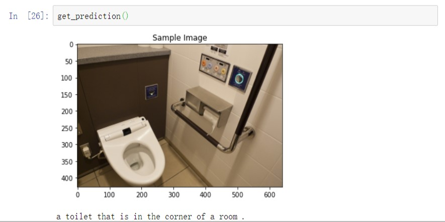
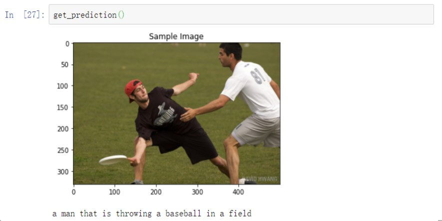
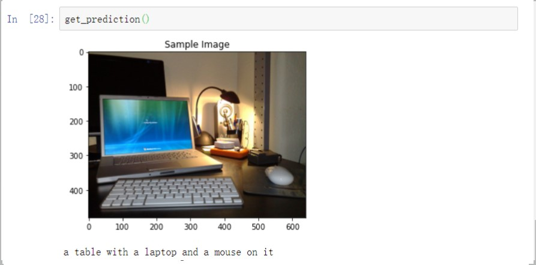
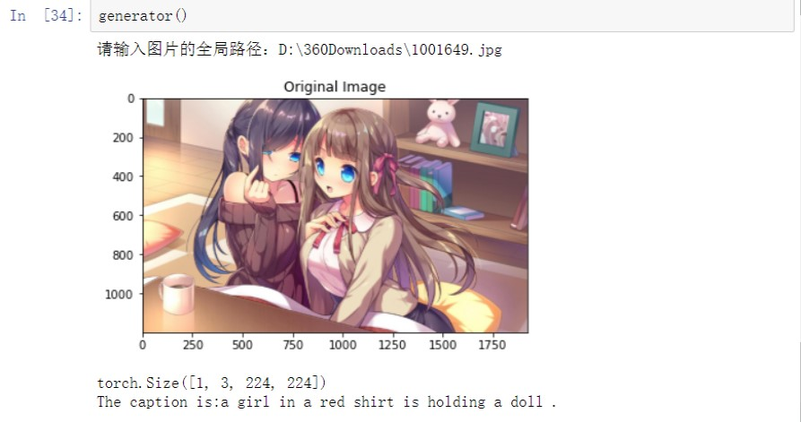
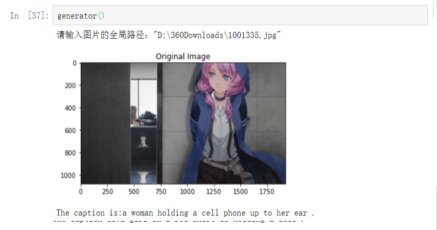

# Image Caption Project（看图说话）
这是用pytorch完成的简单image caption模型，结构是CNN-RNN的形式，数据集为COCO2017，CNN用的是ResNet50,RNN用的是LSTM。
This repository is a recurrency of this article: [Show and Tell: A Neural Image Caption Generator](https://arxiv.org/abs/1411.4555).The tutorial mainly referred to is [mxagar's tutorial](https://github.com/mxagar/image_captioning). If you want to take a very usful lesson, I strongly suggest you to see this tutorial. But if you just need to finish your final project and so on, you can see this repository. This markdown file can be divided into four parts as below: [Dataset and COCOAPI](Dataset and COCOAPI), [Data loader](Data loader), [Model](Model), [Result](Result).

PS:I'm not a native English speaker, so if there are some gramma or spellling errors in this text, please don't care about them, Thanks!

## Dataset and COCOAPI
The complete code is in the COCOAPI_test.ipynb. The dataset I use is [MS COCO2017](https://cocodataset.org/#home). The tool which is mainly used is pycocotools.coco provided by COCO. If you wanna use it, you just need to `import pycocotools.coco `. What you need do to load data from COCO is to  instantiate a COCO class.(Here I take annotations of caption as example.)
```python3
from pycocotools.coco import COCO

dataroot = r"D:\学习资料\实验室\coco2017"

# 初始化image caption任务的COCO API
dataDir = dataroot
dataType = 'train2017'
captions_annFile = os.path.join(dataDir, 'annotations_trainval2017/captions_{}.json'.format(dataType))
coco_caps = COCO(captions_annFile)
```
You have many approches to get the ID of annotations like the following code.`coco.anns.keys()` returns ids of annotations.We usually change it into a list for the convenience in following parts.
```python3
# 获取ID的方法
ids = list(coco.anns.keys())
catIds = coco.getCatIds(catNms=['person', 'dog', 'skateboard'])
imgIds = coco.getImgIds(catIds=catIds)
imgIds = coco.getImgIds(imgIds=[324158])
```
Using below code, you can load images and show their captions.
```python3
# 随机获取一张图片以及它的URL
ann_id = np.random.choice(ids)
img_id = coco.anns[ann_id]['image_id']
img = coco.loadImgs(img_id)[0]
# loadImgs()返回的是只有一个元素的列表, 使用[0]来访问这个元素
# 列表中的这个元素又是字典类型, 关键字有: ["license", "file_name", "coco_url", "height", "width", "date_captured", "id"]
url = img['coco_url']

# print URL and visualize corresponding image
print(url)
I = io.imread(url)
plt.axis('off')
plt.imshow(I)
plt.show()

# load and display captions
annIds = coco_caps.getAnnIds(imgIds=img['id']);
anns = coco_caps.loadAnns(annIds)
coco_caps.showAnns(anns)
```
## Data loader
To understand this part, I advice you to read the `data_loadr.py` and `vocabulary.py` in raw_program.I will show you what will hanppen if you use the function`get_loader()`.
Variables sent into are transform,mode,batch_size,vocab_threshold,vocab_file,start_word,end_word,unk_word,vocab_from_file,num_workers and cocoapi_loc. Transform is the way to transform image tensor. Batch_size is the number of tensors in a batch.Vocab_threshold is the min word frequency. Start, end, unk,are special sign for special words. Vocab_from_file is a variable which sign whether the dictionary file exist.Cocoapi_loc is where you store COCO data.The test mode is less important than train mode, so I will pay more attention on train mode.
After handling variables sent in, this function instantiate a CoCoDataset class that is declared behind in `data_loader.py` by code below.So, let's see the CoCoDataset class thens.
```python3
 # COCO caption数据集
    dataset = CoCoDataset(transform=transform,
                          mode=mode,
                          batch_size=batch_size,
                          vocab_threshold=vocab_threshold,
                          vocab_file=vocab_file,
                          start_word=start_word,
                          end_word=end_word,
                          unk_word=unk_word,
                          annotations_file=annotations_file,
                          vocab_from_file=vocab_from_file,
                          img_folder=img_folder)
```
The CoCODataset has four methods:init, getitem, get_train_inndices and len. The init method instantiate a Vocabulary class in `vocabulary.py` , split the caption taken in and form a list of the length of captions. The getitem method take in tensors of images and captions, and process them roughly. The get_train_indices return a list of annotations' id randomly for model training. The len method return the length of the dataset.
Now let's see the vocabulary class. The aim of this class is forming and save a dictionary file by captions in COCO annotations and a map which can transform caption into a list of number and vice versa.
In the end of COCODataset, it forms a data loader with pytorch util and the get_train_indices method.
Currently, we have finished the data preparation. Following parts are essences of image caption.
## Model
If you have read this article: [Show and Tell: A Neural Image Caption Generator](https://arxiv.org/abs/1411.4555) or you have learnt something about image caption, you may know this task is completed by an encoder which transform images into a tensor by CNN and a decoder which transform this tensor to a sentence by RNN.For the CNN, I use the encapsulated resnet50 in pytorch. Look out that we just need the tensor instead of result of classification, so we don't need the last linear layer in resnet50.The RNN is a bit more difficult than CNN. We firstly embed captions into tensors by embedding layer. After this step, we sent the tensor we get into LSTM. Then we get the output tensor. By methods I mentioned in [Data Lodaer](Data Loader), we can translate the tensor into a sentence.
After we set the model in `model.py`,  we can train it by data from COCO. But before train, we need to set some variables. The most important variables are batch_size, vocab_threshold, num_epochs. These variables can make difference on the time you spend on training.I set these figure as [mxagar's tutorial](https://github.com/mxagar/image_captioning).
```python3
batch_size = 128
vocab_threshold = 5
count threshold
vocab_from_file = False 
existing vocab file
embed_size = 512
hidden_size = 512
num_epochs = 3
save_every = 1
print_every = 100
log_file = 'training_log.txt'
```
The transforms is the same as that in `data_loader.py`.Now, you can initiate the encoder and decoder by the variables you set above and send them into GPU or CPU.
```python3
# Initialize the encoder and decoder. 
encoder = EncoderCNN(embed_size)
decoder = DecoderRNN(embed_size, hidden_size, vocab_size)

# Move models to GPU if CUDA is available. 
device = torch.device("cuda" if torch.cuda.is_available() else "cpu")
encoder.to(device)
decoder.to(device)
```
The following task is choosing a loss function and an optimizer. I choose as those are chosen by [mxagar's tutorial](https://github.com/mxagar/image_captioning).
One more thing you must make sure is files which are used to save weights of encoder and decoder are safe. It's a disaster if you train a model but fail to save it!
```python3
# Check model save/load
import os

# Save
torch.save(decoder.state_dict(), os.path.join('./models', 'decoder-0.pkl'))
torch.save(encoder.state_dict(), os.path.join('./models', 'encoder-0.pkl'))
# Load
decoder_file = 'decoder-0.pkl'
encoder_file = 'encoder-0.pkl'
encoder.load_state_dict(torch.load(os.path.join('./models', encoder_file),  map_location='cpu'))
decoder.load_state_dict(torch.load(os.path.join('./models', decoder_file),  map_location='cpu'))
```
Now, you can train your model!The following is the work of GPU. Go to have a rest and wait for the fruits of victory.
## Result
After long time training(I used 38 hours to train my model on RTX2060), we get a trained model. Let's see how well it works!
First, you need use function get_loader to initiate a data loader class. And set the way to transform images as what we do before training the model.
Then load model we trained by load the weight we have saved during training.
```python3
import torch
import os
import torch
from model import EncoderCNN, DecoderRNN

device = torch.device("cuda" if torch.cuda.is_available() else "cpu")

# TODO #2: Specify the saved models to load.
encoder_file = 'encoder-3.pkl' 
decoder_file = 'decoder-3.pkl'

# TODO #3: Select appropriate values for the Python variables below.
embed_size = 512
hidden_size = 512

# The size of the vocabulary.
vocab_size = len(data_loader.dataset.vocab)

# Initialize the encoder and decoder, and set each to inference mode.
encoder = EncoderCNN(embed_size)
encoder.eval()
decoder = DecoderRNN(embed_size, hidden_size, vocab_size)
decoder.eval()

# Load the trained weights.
encoder.load_state_dict(torch.load(os.path.join('./models', encoder_file),  map_location='cpu'))
decoder.load_state_dict(torch.load(os.path.join('./models', decoder_file),  map_location='cpu'))

# Move models to GPU if CUDA is available.
encoder.to(device)
decoder.to(device)
```
If you remember what we did in [Model](Model) part clearly, you may know that our model return a list of index that can be translated to sentences. That's what we'll do in the next step. 
```python3
def clean_sentence(output):
    # Look for key tokens
    # 0 = <start>
    # 1 = <end>
    # 18 = .
    start = 0
    end = len(output)-1
    point = end
    for i in range(len(output)):
        if output[i] == 0:
            start = i+1
            continue
        if output[i] == 18:
            point = i
            continue
        if output[i] == 1:
            end = i
            break
    if point > end:
        point = end
    sentence = " ".join([data_loader.dataset.vocab.idx2word[x] for x in output[start:point]])
    #sentence += "."
    
    return sentence
```
Now, all works have been done! Let's test our model with a function!
```python3
def get_prediction():
    orig_image, image = next(iter(data_loader))
    plt.imshow(np.squeeze(orig_image))
    plt.title('Sample Image')
    plt.show()
    image = image.to(device)
    features = encoder(image).unsqueeze(1)
    output = decoder.sample(features)    
    sentence = clean_sentence(output)
    print(sentence)
```
Here I show some results of my model.



It seems to be worth for time spent on training!
In `image_caption_generator.py`, I built a generator to generate captions for local images.


